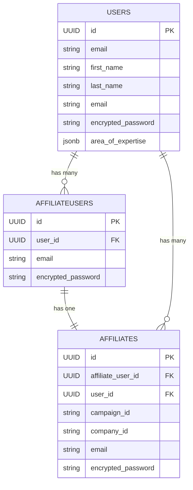
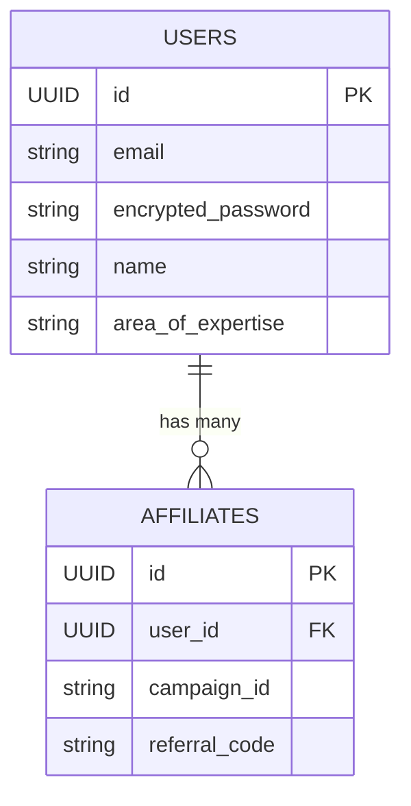

# Unified User Accounts

## Problem

Users having to create a new account per affiliate program/campaign
Bad user experience
Lack of flexibility in creating campaigns

## Objectives

Proposal is to decouple user accounts from the Affiliations to eliminate the need for users
to create separate accounts for each campaign they join. This plan introduces a phased approach,
maintaining backward compatibility while migrating to a unified account system.
End user won't know the changes happening under-the-hood and no UX impact from what it is today.

This prepares the basis for Marketplace.

## Step 1: Create temporary `AffiliateUsers` model

### What

- Temporarily hold user accounts in separate container to prepare support for deduping existing multi user accounts
- Mirror existing account structure in the `Affiliates` table i.e. duplicate accounts and equal number of rows
- Separation of concerns, Affiliations and User data should be stored in separate containers

### How

- Create `AffiliateUsers` table with same user attributes as in `Affiliates` table
- Add fk `affiliate_user_id` to `Affiliates` as one-on-one relationship i.e. no user uniqueness constraint yet

### Achievement

- At this stage nothing changed except introduction of new table and a FK column
- Ground is prepared for intermediate stage of separating User data from Affiliates

## Step 2: Copy Data and continuous sync

### What

- Silently copy data from `Affiliates` and `AffiliateUsers`
- Keep them in sync going forward

### How

- Copy over all current affiliate user data from the `Affiliates` table to the `AffiliateUsers` table
  `Affiliates` => `email, password, ID, etc.` => `AffiliateUsers`
- Keep the `Affiliates` table as-is for backward compatibility
- Copy corresponding `AffiliateUsers` ID to `Affiliates` in `affiliate_user_id` FK column
  - If `Affiliates` table has lot of records there might be locking issues, therefore this must be done in batches
  - Since UUID is used, can even copy over the same Primary Key from `Affiliates` to `AffiliateUsers`
  - It should be done in background jobs with retry mechanism in place
  - If needed a distributed lock can be used to maintain data integrity during migration

- Going forward ensure that for any regular campaign both `Affiliates` and `AffiliateUsers` tables
  are updated together and kept in sync e.g. update `create_user_service` or `create_affiliate_service`
  to apply changes to both tables and properly set `affiliate_user_id`
  - If this Create Affiliates is a heavy process, delegate this to a background job

- Ensure indexes on `email` and `affiliate_user_id` for optimal performance during migration
- Additionally, we need to work on Roles based access control (RBAC)

### Achievement

- Intermediate state ready
- Nothing has changed from Customer/User experience (CX/UX) perspective

## Step 3: Introduce `Users` model

### What

- Create container to hold **unique user accounts**
- Each user will have a single account, and their campaigns will be linked via associations
- This can be done in-parallel with Steps 1 ane 2 

### How

- Create `Users` table with all necessary user metadata attributes like email, passwords, names,
  areas of expertise, etc.
- Uniqueness constraint applied on Email address
- Add `user_id` FK to `AffiliateUsers` table i.e a User can have multiple `AffiliateUsers`, allow `nil`

### Achievement

- Final skeleton is prepared for complete separation of concerns between campaigns and user accounts
- No impact on CX/UX, everything is done behind the scenes

## Step 4: Create deduped user accounts

### What

- Detect duplicate user accounts in `AffiliateUsers`, populate `Users` table and link them together

### Assumptions

- User email accounts are verified and confirmed e.g. users get email when an account is created
  or it's an OAuth account
- Unique users can be determined using email address
- If not then first user accounts need to be verified (whole different topic)

### How

- Prepare a list of duplicate user accounts
- Validate this list manually just to ensure there are no mistakes
- Copy over all user metadata of each uniquely recognized User from `AffiliateUsers` to `Users`
  table i.e. by shared email address in batches
  - Table isn't used in Production so no issues with database locks
  - For new accounts better approach would be to ask users to reset their password on next login
  - However if we want to do this completely in background, first copy an existing password using
    either most recently used or most used account
  - Since UUID is used, could also copy over primary key ID from `AffiliateUsers` to `Users`

- Add newly created User record's ID to `user_id` in `AffiliateUsers` and `Affiliates` tables based on email address
  - Tables are being used in Production already, therefore this must be done in batches to avoid longer database locking
    and use distributed locks when writing to already in use `Affiliates` table

- Update `create_affiliation_service` to automatically detect duplicate accounts and sync them going forward
  - This should be in place before actual data migration

### Achievement

- Almost there, unique User accounts a reality now
- Continuous sync between `Affiliates`, `AffiliateUsers` and `Users` is in place
  i.e. data consistency post data copy/migration
- No impact on existing UX

## Step 5: Replicate `Affiliates` associations with `Users`

### What

- Replicate all associations of `Affiliates` to `Users` model
- Preparation for when we drop user details from `Affiliates`

### How

- For all the associations with FK `affiliate_id`, create a companion `user_id` association
- Copy over `User ID` to that column
- Update all services where `Affiliates` associations are created/updates
  and simultaneously also do the same for `Users`

### Achievement

- This makes the `Users` model equivalent of `Affiliates` except the campaign and company part

## Step 6: Unified user account login

### What

Now that we have separated User data from Affiliates and deduped user accounts,
all services and features in place need to be adjusted to allow users login using their single unified account
with backward compatibility

### How

Create new services / update existing that can handle new single user account logic

- Allow users to login with their existing account from `Users` table
- Assuming they have multiple accounts and passwords, ensure that there is password reset feature in place
- If User email doesn't exist in `Users` table, its treated as a new user account
- Back sync User data to `Affiliates`, `AffiliateUsers` tables to keep the existing system intact
- Existing Affiliate service that relies on duplicate user account should still be functional at this stage
- This should be locked behind a feature flag, code can be deployed to production but not in use
  [Flipper](https://github.com/flippercloud/flipper) gem can be used for this

## Step 7: User Communication and Rollout planning

### What

- Notify users of the upcoming changes and assist them in transitioning to the new system
- Prepare detailed staged rollout plan with set dates

### How

- Set a deadline for the switch
- Prepare communication plan to inform users way in advance as many times as possible
- Send users an email notification explaining the transition to a **single account system** and the necessity of it 
- In case of staged rollout only those users should be contacted by email, for other users nothing changes yet

### Achievement

- Deadline for switch and preparedness
- Better Customer Experience (CX)

## Step 8: D-day, Rollout unified user account feature

### What

Now that we have

- Separated User data from Affiliates and deduped user accounts
- All services and features in place with backward compatibility
- Staged rollout and rollback plans in place

Execute these stages and finally allow user to login using their single account

### How

Since this is the first change that involves users, we need a careful rollout strategy

- Use feature flags to test this on select group of users, gradually increasing group size
  - Test and monitor for any issues, keep analytics on things like login failures, password reset requests, etc.
  - In case of hard issues this new feature can be completely disabled using the feature flag
- Later on the predefined date a complete and final switch from old service to new service
  for unified user login experience will be made

### Achievement
- Separation of concern is now complete with least possible CX/UX impact on end users
- Users can now use a single account to apply for multiple campaigns
- We are still maintaining `Affiliates`, `AffiliateUsers` instead now the login is ported via `Users`
  and back synced to the other tables
- This keeps door open in case something horribly goes wrong and we need to rollback everything

## Step 9: Finally drop legacy services

### What

Now that we have been running new unified user account feature in production for some time
and battle tested, it is time to remove legacy code and keep our house clean.

### How

- Stop back syncing data
- Drop `AffiliateUsers` table and its usage from all services
- `Affiliates` only point to `Users` table now
- All duplicated data from `Affiliates` table should be dropped in batches to avoid locking database
  for unspecified time or with downtime notice if that works
- Drop all `Affiliates` associations i.e. `affiliate_id` FKs from various other models and services

### Achievement

- Migration completed from having to create duplicate accounts to single account to rule them all

## ER Diagrams

### During migration

<!-- [](https://mermaid.live/edit#pako:eNqdVF1P6zAM_SuVpb6VKwYbF_o2QSdVbJerFV5Qpcqs7hbUJlWSCsa2_07WD1a28pmnxOf4OLEdr2AmYgIXSF4xnEvMQm6ZdRd408BaVQdzvPOvLBZb_68bi9KS8blFGbJ0z5YwqXTEMaM9IMVue5cI8Zlc5priKEelnoSMG8KjEvzBQkkYiSSi55ykZqrW3IS82gxHI3_sD2-9T19RWjBJWMpQU1QokpEhjN4TDs31JWeY5cjm3ID7iDAIXx4CP3nr4WO-LMvn9_1VcNueeiNvOh2O3yLb9mHsN9suna0r2HZLLxiOve9pSUpISkw_lLq8mUz8IPBv_n1PUJnu6xBrN_16fXQkVvs5d60QFqiszFQ1hM6ybB3X63bnNU6CU-PTHaNb37ZbhNplV4tujx1eO1TJ7iZXWE1sp_I9HRzISJreic2gKLMcgl6Q-cewJcaUYJHqrezGULHQIljyGbhaFuSAFMV8AW6CqTKnIo9Na9SzpqFQzLSQk2oSlQPJAfN9wF3BM7j9s7M_p_3B3_P-YHBx0jvvObAE93jjwIsQRqNXku_L_VZv8wrkMXCt) -->

### After migration

<!--  -->

## Considerations and Next steps

### Allow merging user accounts

#### What

- Allow users to merge their accounts into one where users used completely different emails

#### How

- Create merge user service where all references and associated records are reassociated to new(old) User account ID
- Provide a simple UI/UX to merge the account as long as user can provide valid password for both accounts,
  they can initiate the merging process
- We will not execute this immediately
  - Create a merge request record in database
  - Send user an email to confirm the merging
  - Once user clicks on it, then only initiate the merge processed as background job
  - Send user confirmation email once account merging is finished
  - User can only initiate one merge request per email address at a time
- The merge plan can only be valid for certain fixed time frame because user might perform activities in between
- Existing payouts should be marked unverified and ask users to verify again for safety reasons

#### Achievement

- For certain edge cases, we now allow users to manually merge their accounts
- Slightly complex but necessary UX and CX

### DRY Run

This entire process can also be backed by DRY Run at every stage
so that we can verify everything before applying to production

### Data Versioning

We could think of versioning records to ensure rollbacks and easy debugging in case of issues during this migration

### OAuth login

Best to offer **OAuth login options** like Google, Microsoft and LinkedIn to reduce password reset requests
and ease the transition

### Roles bases access control (RBAC)

If not already done, introduce various roles such as `Affiliate`, `Company Admin`,
`Campaign Moderator`, and `Admin` to start with.

`Affiliate` being the default role in the system as soon as user signs up.

[pundit](https://github.com/varvet/pundit) gem can be used for this

### Query cache

- Might be helpful to cache the Subdomain constraint query
- Also check if the Company is actually active
- Is the subdomain unique in Company table? if not then what happens if there is a duplicate?

### Multi-tenancy and Database sharding

If it ever happens that database size get too big or performance degrades due to heavy traffic,
sharding per tenant might be an option.

### UUID

UUID is good for portability though it does impact index performance, certainly size of database also plays role.