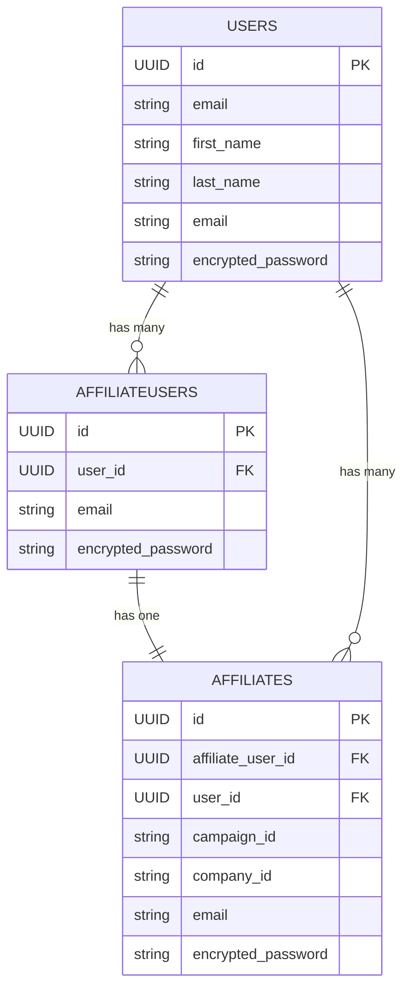
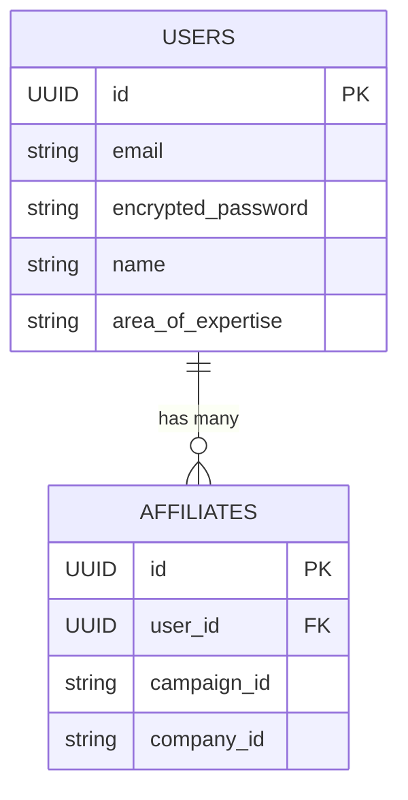

# Unified User Accounts

## Problem

Users having to create a new account per affiliate program/campaign

Bad user experience

Lack of flexibility in creating campaigns

## Objectives

The plan is to decouple user accounts from Affiliations, eliminating the need for users to create separate accounts
for each campaign. This phased approach maintains backward compatibility while migrating to a unified account system.
The end user won't notice any changes and there will be no impact on the user experience.

This prepares the basis for [Marketplace](./3_unified_campaign_model.md).

Check [flow charts](./flow_charts.md) for visualization of the proposed plan.

## Step 1: Create temporary `AffiliateUsers` model

### What

- Temporarily hold user accounts in separate container
- Mirror existing account structure in `Affiliates` table

### How

- Create `AffiliateUsers` table with same user attributes as in `Affiliates` table
  such as `email`, `encrypted_password`, etc.

- Add fk `affiliate_user_id` to `Affiliates` as one-on-one relationship i.e. no uniqueness constraint
- Ensure indexes on `email` and `affiliate_user_id` for optimal performance during migration

### Achievement

- Nothing changed except introduction of new table and FK column

## Step 2: Copy Data and continuous sync

### What

- Silently copy data from `Affiliates` and `AffiliateUsers`
- Keep them in sync going forward

### How

- Update services to apply changes to both `Affiliates` and `AffiliateUsers` tables together
  and kept in sync e.g. `create_affiliate_service` and properly set `affiliate_user_id`

- Must deploy before copying existing data to `AffiliateUsers` table
- Now, copy existing affiliate user data from the `Affiliates` table to the `AffiliateUsers` table
- Copy corresponding `AffiliateUsers` ID to `Affiliates` in `affiliate_user_id` FK column
  - Since UUID, can use the same Primary Key for `Affiliates` and `AffiliateUsers` tables
  - Perform in batches in background jobs with retry mechanism
  - Distributed lock can be used to maintain data integrity during migration
    [redlock gem](https://github.com/leandromoreira/redlock-rb)

### Achievement

- Intermediate state ready
- Nothing has changed from User experience (UX) perspective

## Step 3: Introduce `Users` model

### What

- Create container to hold **unique user accounts**
- Each user will have a single account, and their campaigns will be linked via associations

### How

- Create new or use existing `Users` table with all necessary user metadata attributes like email, passwords, names,
  areas of expertise, etc.
- Uniqueness constraint applied on Email address
- Add `user_id` FK to `AffiliateUsers` and `Affiliates` tables, allow `nil`
- Add index for this FK to improve join table queries

## Step 4: Create deduped user accounts

### What

- Insert deduped user accounts in `Users`

### Assumptions

- User email accounts are verified and confirmed e.g. users get email when an account is created
  or it's an OAuth account
- Unique users can be determined using email address

### How

#### Update services

- Update `create_affiliation_service` to automatically detect duplicate accounts based on email
  and insert into `Users` table

- Update `user_id` in `AffiliateUsers` and `Affiliates` tables based on email address
- Service changes should be deployed to production before below data migration

#### Data migration

- Copy over all user metadata of each uniquely recognized User from `AffiliateUsers` to `Users` in batches
- Set temporary password for newly created `User` records, users will be asked to reset it later
- Update `user_id` in `AffiliateUsers` and `Affiliates` tables

### Achievement

- Deduplicated user accounts
- Still no impact on existing UX

## Step 5: Replicate `Affiliates` associations with `Users`

### What

- Replicate all associations of `Affiliates` to `Users` model
- Preparation for when we drop user details from `Affiliates`

### How

- For all the associations with FK `affiliate_id`, create a companion `user_id` association
- Adjust all services where `Affiliates` associations are created/updated to also account `Users` model associations
  and deploy to production first
- Then copy over `User ID` of existing matching records to these associations

### Achievement

- This makes the `Users` model equivalent of `Affiliates` except the campaign and company part

## Step 6: Unified user account login

### What

- Implement new single unified account user account login as separate feature
- Keeping existing duplicate account login untouched for backward compatibility

### How

Create new services / update existing that can handle new single user account logic

- Allow users to login with their existing account from `Users` table
- Ensure that there is password reset feature in place to handle temporary passwords
- If User email doesn't exist in `Users` table, its should treated as a new user account
- Back sync User data to `Affiliates`, `AffiliateUsers` tables to keep the existing system intact
- Existing Affiliate service that relies on duplicate user account should still be functional along side
- This should be locked behind a feature flag, code can be deployed to production but not in use
  [Flipper](https://github.com/flippercloud/flipper) gem can be used for this

## Step 7: User Communication and Rollout planning

### What

- Prepare detailed staged rollout plan with set dates
- Notify users of the upcoming changes and assist them in transitioning to the new system

### How

- Prepare and send users email notifications explaining the transition
  to a **single account system** and the necessity of it

- In case of staged rollout only those users should be contacted by email, for other users nothing changes yet

### Achievement

- Deadline for switch and preparedness
- Better Customer Experience (CX)

## Step 8: Rollout unified user account feature

### What

Execute staged rollout ensuring rollback plans in place

### How

Since this is the first change that involves users, we need a careful rollout strategy

- Use feature flags to test this on select group of users, gradually increasing group size
  - Test and monitor for any issues, keep analytics on things like login failures, password reset requests, etc.
  - In case of hard issues this new feature can be completely disabled using feature flag
- Later on predefined date completely switch from old service to new service
  for unified user login experience

### Achievement

- Separation of concern is now complete with least possible CX/UX impact on end users
- Users can now use a single account to apply for multiple campaigns
- We are still maintaining `Affiliates`, `AffiliateUsers` instead now the login is ported via `Users`
  and back synced to the other tables

- This keeps door open in case something horribly goes wrong and we need to rollback everything

## Step 9: Finally drop legacy services

### What

Now that we have been running new unified user account feature in production for some time
and battle tested, it is time to remove legacy code and keep our house clean.

### How

- Stop back syncing data
- Drop `AffiliateUsers` table and its usage from all services
- `Affiliates` only point to `Users` table now
- All duplicated data from `Affiliates` table should be dropped in batches to avoid locking database
  for unspecified time or with downtime notice if that works
- Drop all `Affiliates` associations i.e. `affiliate_id` FKs from various other models and services

### Achievement

- Migration completed from having to create duplicate accounts to single account to rule them all

## ER Diagrams

### During migration

<!-- [](https://mermaid.live/edit#pako:eNqlVFFvgjAQ_ivkkr7hMjd1jjcyISHTuch8WUhMIwWbQEtKyebU_74KqKidMxtP7XfffXfcXW8Fcx4SsICIAcWxwGnADPVNfWfiG6vqoq5Tb2DQ0Hh93iG5FJTFBkkxTU6wiIpczhhOyYkhwXpcJ0LYXCwzScJZhvP8g4uwImwCVh1s1_WGnv3mXEyzRHAU0YRiSWZFTsRMEdxjwjlcZzHHaYZpzJTx1MKVhS3PDf_7mV_rfjnfPwVHaOK4zmRiD_eRETqPvccO5WykgFBDz7eHznVagkRECJz8KPU0Ho083_fGL9cJ5mq8NGLNqV6vWy2-Oq25ZQSwwLmRqq4GoG3L1nG9bk7ezokzsvPRx9DrI9Qg1C6HXug9DvbaoSq2nlzZamKzlMd0MCElQs1OqDZBWeUA5IKohwpbYkgiXCRyK7tRVFxI7i_ZHCwpCmKC4EW8ACvCSa5uRRaq0aiXyR4lIZVcjKpdU64cE9T7AWsFn2B1er2b-073od_pdh_v2v22CUuwbjcmfHGuRNol-b08b2NuvgFkFGYt) -->

### After migration

<!--  -->

## Considerations and Next steps

### Allow merging user accounts

#### What

- If there are users who create multiple accounts with different email addresses, then allow them to merge
  their accounts into one where users used completely different emails

#### How

- Create merge user service where all references and associated records are reassociated to new(old) User account ID
- Provide a simple UI/UX to merge the account as long as user can provide valid password for both accounts,
  they can initiate the merging process
- We will not execute this immediately
  - Create a merge request record in database
  - Send user an email to confirm the merging
  - Once user clicks on it, then only initiate the merge processed as background job
  - Send user confirmation email once account merging is finished
  - User can only initiate one merge request per email address at a time
- The merge plan can only be valid for certain fixed time frame because user might perform activities in between
- Existing payouts should be marked unverified and ask users to verify again for safety reasons

If the number of such users is very low, we can even do this from server side on case to case basis
instead of building this all.

#### Achievement

- For certain edge cases, we now allow users to manually merge their accounts
- Slightly complex but necessary UX and CX

### DRY Run

This entire process can also be backed by DRY Run at every stage
so that we can verify everything before applying to production.

### Transactions

Appropriately use Database/Active Record transactions to ensure data integrity across
the three tables including in batches.

### Data Versioning

We could think of versioning records to ensure rollbacks and easy debugging in case of issues during this migration,
[paper_trail](https://github.com/paper-trail-gem/paper_trail) gem can be used for this.

### OAuth login

Best to offer **OAuth login options** like Google, Microsoft and LinkedIn to reduce password reset requests
and ease the transition.

### Roles bases access control (RBAC)

If not already done, introduce various roles such as `Affiliate`, `Company Admin`,
`Campaign Moderator`, and `Admin` to start with.

`Affiliate` being the default role in the system as soon as user signs up.

[pundit](https://github.com/varvet/pundit) gem can be used for this

### Query cache

- Might be helpful to cache the Subdomain constraint query
- Also check if the Company is actually active
- Is the subdomain unique in Company table? if not then what happens if there is a duplicate?

### Multi-tenancy and Database sharding

If it ever happens that database size gets too big or performance degrades due to heavy traffic,
sharding per tenant might be an option.

### UUID

UUID is good for portability though it does impact index performance, certainly size of database also plays role.