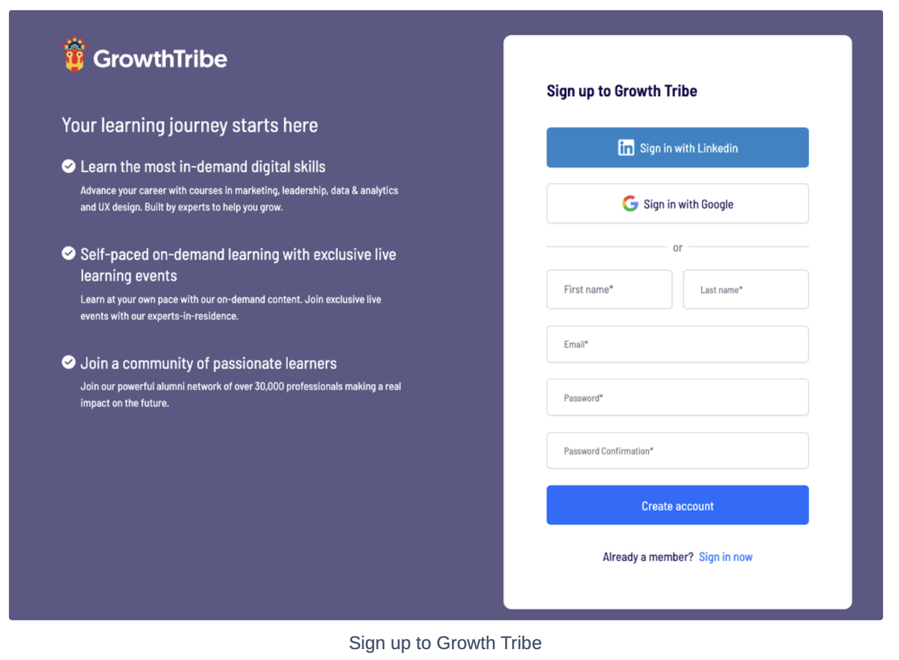

# Multi Domain Authentication

## Problem

Users have to log in separately on different domains, such as the company's main domain, subdomains, or a completely
independent domain. This results in a poor user experience and complicates access management across domains.

## Objective

Implement a seamless authentication system that allows users to log in once and gain access across multiple
domains—both subdomains and entirely separate domains—while maintaining security and compliance with browser policies.

## TL;DR

- Seamless authentication is easily possible for subdomains while the root domain stays the same `example.com`
- User can login from any subdomain and an HTTP-only cookie can be set to root domain

However, for a completely different domain i.e. `example.com` vs `my-custom-domain.com`

1. If we want a full white-labeling, then user will have no choice but to re-login again
2. If we can maintain auth route to our domain, then users can share the authentication across domain using SSO

## Solutions

I have considered following solutions to solve this problem

### Option 1: Shared Cookies Across Subdomains (NOT FEASIBLE)

#### What

Share authentication cookies between the main domain and its subdomains.

#### How

- Set the cookie's `Domain` attribute to the parent domain (e.g., `.example.com`) when a user logs in
- This allows cookies to be accessible on `example.com` and all subdomains like `xyz.example.com`

#### Limitations

While it's a good trick this does not solve the problem completely

- Only works for subdomains under the same parent domain
- It can not be used for completely independent domains like `my-custom-domain.com`

### Option 2: Cross-Domain Session Checking (NOT FEASIBLE)

#### What

Attempt to use the shared backend (database) to recognize active sessions across different domains

#### How

- When a user logs in on one domain, store the session in the database
- On a different domain, check for an active session in the database and set a local cookie

#### Limitations

This option has several blockers

- Browsers won't allow setting cookies from one domain to another and application can not identify the user without a cookie
- When coming from a completely different domain, there is no identifier and hence application
  can not link the request to an existing user session

### Option 3: Single Sign-On (SSO) with Independent Authentication Server (RECOMMENDED)

#### What

- Implement centralized authentication system that all domains trust for user authentication

#### How

1. Set Up Central Authentication Server e.g. [Keycloak](https://www.keycloak.org/) or even explore ready-made solutions like [Clerk](https://clerk.com/)
2. Authentication Flow
   - User visits a domain and is redirected to `auth.example.com` if not logged in
   - After authentication, the user is redirected back with a token
   - Rails validates the token and establishes a session

#### Benefits

- Secure
- Independently scalable
- Good user experience - Users log in once and access all domains seamlessly
- Keycloak is customizable, Open Source, different branding and themes can be applied as well

#### Limitations

- Requires additional infrastructure and configuration
- Additional overhead of authentication server maintenance
- Users will still see our company `example.com` domain at login which is different than the merchant domain
  100% white labeling and preserving login sessions cross-domain is not possible

## Implementation Plan

### Step 1: Set Up Central Authentication Server

#### What

Deploy dedicated Keyclaok server to handle authentication

#### How

Keyclaok deployment is as simple as a Docker container deployment on Heroku or Cloud Run

### Step 2: Update Rails Application to use Keycloak based authentication

#### What

Update our Rails application to Authentication via Keycloak

#### How

- User is redirected to Keycloak login page
- Several OAuth login options can be provided such a Google, LinkedIn, etc.
- Once authenticated user is redirected back to the Rails application, user session is established and a cookie is set

  ```ruby
  class ConfigureSessionStore

    def self.call(config)
      config.session_store :active_record_store,
                          key: session_key,
                          domain: :all,
                          secure:,
                          expires: <Set appropriate value>

      config.middleware.use ActionDispatch::ContentSecurityPolicy::Middleware
      config.middleware.use ActionDispatch::Cookies
      config.middleware.use config.session_store, config.session_options
    end

    def self.session_key
      Rails.env.production? ? '_my_app_session' : "_my_app_#{Rails.env}_session"
    end

    def self.secure
      !Rails.env.local?
    end

  end
  ```

This is an extremely simplified overview but this is what I have already implemented and used.

