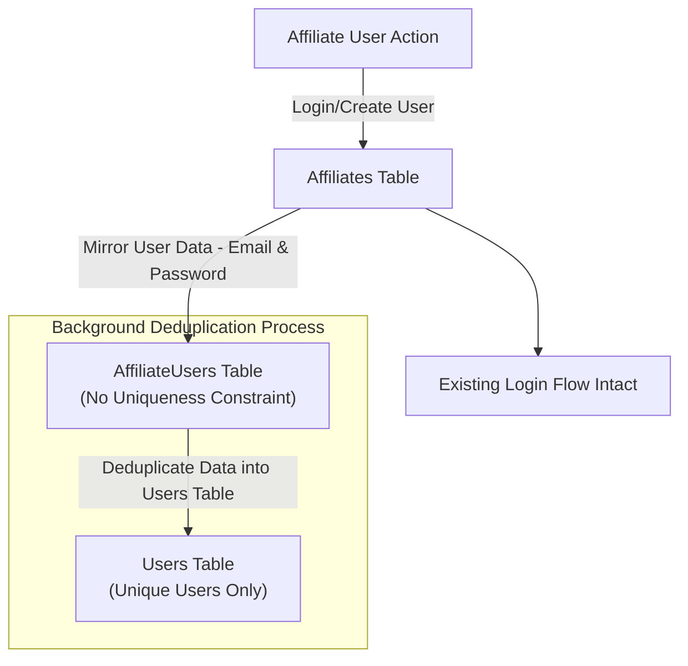
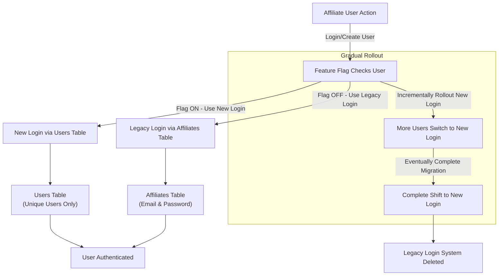
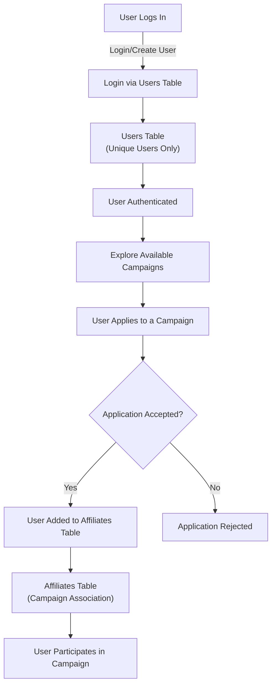

# Flow charts

There are some high level rough flowcharts to start with. After careful and proper planning these should be adjusted.

## Initial data migrations

<!-- [](https://mermaid.live/edit#pako:eNp1km9r2zAQxr_KcdCygZM5Thz_YRS6poPBuhXWvmncF4olO2KO5EkybZrku0-WkibtmF8Y3-m55-5-1gZLSRnmWDXyqVwSZeBuVgiwz71m6rI0XIr5ZVXxhhPDXBJ89hEGg4vtd1lz8elKscPpFl7V-o4sGnas1uASj97_ncy53XClpPJdZsQQGMD1ivAGzuGWaP0kFT3x72X7HgW-zfpO8HmhLuDDDwn3gv_pmGBaw5UU2ijChflYoJ3lv9PA9TPXhova7Tg_ROBC-GqBwTdhSGn2C_n32Rl8IeXvWslOUGiVLPumXGhOGRDQ3aJWpF168SE6Kbn1FfMTkxmjXdvwkvTYYS94T_EIw5E81jBP0u4r4YTNFt7g-5eaR7Yv-SmatcfVN2WCYoArpuy_ofbybPp0gWbJVqzA3H5SVpGuMQUWYmelpDPy11qUmBvVsQDtXvUS84o02kZdS-2YM04si9VrllFupLrx19Pd0gBbIjDf4DPmozgeZlE6ySZJPB2F03Aa4BrzOBvG0zCNknEyHmfZKNsF-CKldQ2H6SSJ0jCM4kkajZIkcXYP7rCfavcXR0cG0g) -->

## New login via Users model

Once data has been migrated and continuous data sync is in place, we will implement new login mechanism.

This new login feature is based on `Users` table/model and will be gradually rolled out all the while
the legacy login mechanism continues to function.

<!-- [](https://mermaid.live/edit#pako:eNqVVF1v2jAU_StXljptErBCSgnRVKmCMk0q7TToy0ge3MQh1hybOXYZa_vf548kpF01aXm6vj4-59x7HT-iVGQERShnYp8WWCpYz2MO5ruriLxMFRV8c5nnlFGsiEuCzybQ7188XYst5R9nkjS7T7AwsZZkwfB2U8dgFzArSPqjcqgk5l7l5KTBQ24xGVFElpSTCpilhh1WhYd2eJ20C25voG8Z4YbswZl5sqGLNm0OHih2uhWs8T0jyb8YF4ua8ppscXpoWP3KE3d3HHfboaNAW5914WuxTQZVSKG3RW1HWbSHNratFb_rqDYx6jiHT_fyAt7fcfpTk5rjlrPDhxglx7n5k47oUquCcEVTYy7b-Pl1U12ndVlvmO3U13HcaYnXalGN89d9qe1flZgyeAdfcVXthcyO7l9R_HcJa4l5Re39BCX2WGYV5JoxKOlWYpv2yErfm_WugM8SZxoz-CYYE1r53b9vxheeSlIaRczYoQF371zNs2xkNkshm_ms9lSlhfFzPJA0Qq_PObWrB6OkndRMlDtm_gloEeYHMwUdhVrEqqC5ekuF8Kzp0IujrrlzYg_7Sb6816tDpUhZA7IE9VBpfk1MM_NcPFq6GJkhlCRGkQkzkmPNVIxi_mygWCuxOvAURUpq0kPuGqEox6wyK73LzODmFBsnZZslGVVCLv2D5N6lHtphjqJH9AtF48lgFAZnYTA9HU2H4WTYQweTPR-cjyfheDIMzkbD80nw3EO_hTCkp4PQgIJpGAzH0-A0HIeO7bvbtKae_wAina_K) -->

## Final complete migration to new login mechanism

One the gradual rollout of new login mechanism is complete with proper testing, legacy features and data can be dropped.

This leaves us with the final state of only one way to create users and authenticate them via `Users` table/model.

<!-- [](https://mermaid.live/edit#pako:eNp1U11v2jAU_SuWpUqbBCx8BJJo6hSVTZq0dVNHHzbCg-sY8GTszHbaMuC_78ZOQqi6PCS27znnnpvre8BU5QwneC3UE90SbdFinkkEz71hOqWWK7msluiL2hj0Wa5Qv399hA2X7240I5Y55BHdsid3unRv9MiJCxi0IA-Crbyof19dVWgkHLDKjOxWq3KzrRm2Ynhoo1pl9VEnt8xwRxy9f9DX6M295H9KVmt8k2L_NsOrczGe6YTS0m6ZtJyC_dyXd3EErNapi7LnQijNDKJkVxC-kcbHL1hO-qNHLusvSh8JFy7xTUOtPTUIZ6goxL42AksOmaxCpOV0DTkAJITOoEIrykxjphJxcnNGuYH4oYtNKWUF2Pxw-o8YqQE-2Gi4fv9k5ojSPF-odL3mgkO5prab51A5mD0HLjr-guSrbbdNM1-S64425aPUGEW5s-mb-moBmv1m9PUCbtUR3blwdaG7pLua1BX9xCURiFw011j41DVd-m_v5neYH055cf473RMEt7jtJ-7hHdM7wnMYvkMlm2HItmMZTmCZszUphc1wJk8ABSfqx15SnFhdsh52w4KTNREGdmWRg_6ck40mu_aU5dwq_dWPt5vyHi6IxMkBP-NkMgoG4SgOJ9M4DqNgOA57eI-T_iiIB1EUBMPZOJpFk-l0curhv0qB7nAQxLM4HoXhOJjCMxw5wV8uWPk6_QP3unBr) -->

